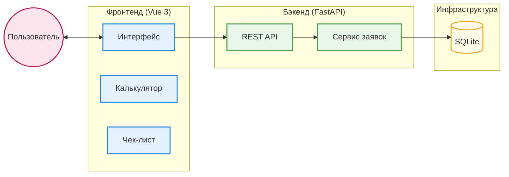
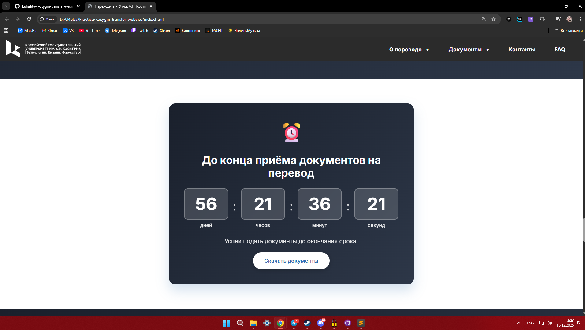

<div align="center">
    
    <h1>Сервисный лендинг <a href="https://github.com/bukabtw/kosygin-transfer-website">РГУ им. А.Н. Косыгина</a></h1>
    <p><b><i>Интерактивный сервис для перевода студентов из других вузов (∩^o^)⊃━☆</i></b></p>
    <br>

    
</div>

## 📌 [Этот лендинг для перевода студентов](https://github.com/bukabtw/kosygin-transfer-website) это...

...интерактивный сервис с пошаговой инструкцией, калькулятором шансов и чек-листом документов. Проект разработан для упрощения процесса перевода студентов из других учебных заведений в РГУ им. А.Н. Косыгина.

Этот проект резюмирует практические навыки, полученные в процессе прохождения производственной практики в **РГУ им. А.Н. Косыгина**.

## 🏗 Архитектура

### Диаграмма системы

Основные части системы взаимодействуют следующим образом:

1. **Пользователь** работает с интерфейсом (**Фронтенд**);
2. **Фронтенд** отправляет данные заявок на консультацию в **Бэкенд** (FastAPI);
3. **Бэкенд** сохраняет заявки в базу данных **SQLite**.



## 🚀 Запуск проекта

### Требования

* **Node.js** (версия 18+)
* **Python** (версия 3.9+)

### Запуск Бэкенда

```bash
cd backend
python -m venv venv
# Windows
.\venv\Scripts\activate
pip install -r requirements.txt
# Запуск сервера
uvicorn main:app --reload
```

Бэкенд будет доступен по адресу: [http://localhost:8000](http://localhost:8000)

### Запуск Фронтенда

```bash
cd frontend
npm install
npm run dev
```

Приложение будет доступно по адресу: [http://localhost:5173](http://localhost:5173)

## 📚 API-Документация

После запуска бэкенда интерактивная документация доступна по адресу:
[http://localhost:8000/docs](http://localhost:8000/docs)

### Основные эндпоинты

* `POST /api/consultations/` — Отправка заявки на консультацию
* `GET /` — Проверка статуса API

## 🛠 Технологический стек

| Область | Технология |
| ---- | --- |
| **Фронтенд** | Vue 3, Vite, Axios, CSS3 |
| **Бэкенд** | Python, FastAPI, SQLAlchemy, Pydantic |
| **База данных** | SQLite |
| **Инструменты** | Mermaid, Git |

## 📂 Структура проекта

```text
├── backend/                # Сервер (FastAPI)
│   ├── main.py             # Основной файл приложения
│   ├── models.py           # Описание таблиц БД
│   └── requirements.txt    # Зависимости Python
├── frontend/               # Клиент (Vue 3)
│   ├── public/             # Статика и скриншоты
│   ├── src/                # Исходный код компонентов
│   └── package.json        # Зависимости Node.js
└── README.md               # Документация проекта
```

## 📸 Скриншоты

<details>
<summary>Посмотреть скриншоты системы</summary>

*Главный экран*


*Чек-лист документов*


*Часто задаваемые вопросы*


*Таймер дедлайна*

</details>

---

<div align="center">
    <a href="https://github.com/bukabtw/kosygin-transfer-website">
        
    </a>
    <br>
    <sub><b>Сервисный лендинг // РГУ им. А.Н. Косыгина</b></sub>
    <br>
    <sup><i>Made with love by <a href="https://github.com/bukabtw" target="_blank" title="bukabtw">bukabtw</a></i></sup>
</div>
