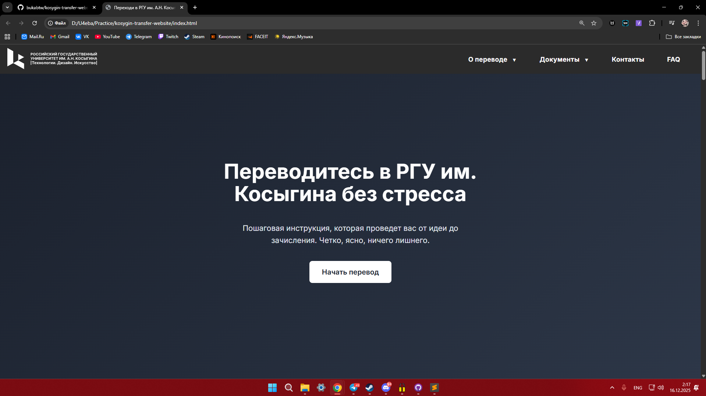
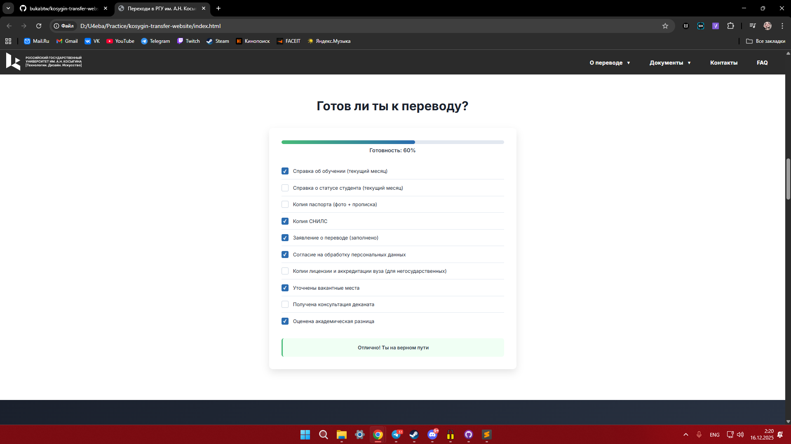
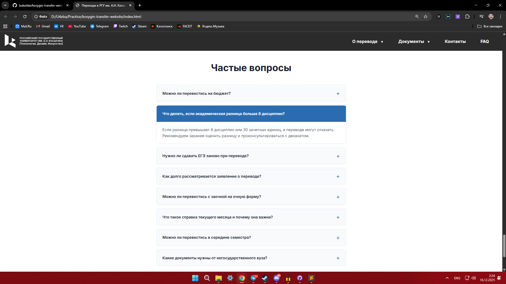

# Сервисный лендинг для перевода студентов в РГУ им. А.Н. Косыгина

**Интерактивный сервис** с пошаговой инструкцией, калькулятором шансов и чек-листом документов для перевода студентов из других вузов.



## 📌 О проекте

Проект разработан в рамках производственной практики в **РГУ им. А.Н. Косыгина** по нечёткому ТЗ: "Сделайте лендинг для перевода студентов из других вузов". 

**Особенность задачи:** Необходимо было самостоятельно разработать структуру, контент и интерактивные элементы для максимально полезного сервиса.

## 🛠️ Технологии

*   **HTML5** — семантическая разметка, доступность
*   **CSS3** — Flexbox, Grid, адаптивная вёрстка, CSS-анимации
*   **JavaScript (Vanilla JS)** — полный функционал без библиотек:
    *   Интерактивный чек-лист документов с прогресс-баром
    *   Калькулятор шансов на перевод с алгоритмом расчёта
    *   Таймер обратного отсчёта до дедлайна
    *   Система копирования контактов в буфер обмена
    *   Аккордеон FAQ с анимацией
    *   Адаптивное мобильное меню с dropdown
    *   Анимации появления элементов при скролле
*   **Адаптивность** — полная поддержка мобильных устройств

## ✨ Уникальные особенности

### 🎯 Полноценный сервис, а не просто лендинг
*   **Чек-лист документов** — интерактивный список с автоматическим расчётом готовности
*   **Калькулятор шансов** — алгоритм оценки вероятности успешного перевода
*   **Таймер дедлайна** — обратный отсчёт до конца приёма документов
*   **Система копирования** — одним кликом копировать контакты и адрес

### 📱 Продвинутый UX/UI
*   **Анимации по скроллу** — плавное появление секций
*   **Интерактивная карта** — встроенная Яндекс.Карта
*   **Уведомления** — система всплывающих уведомлений
*   **Адаптивные сетки** — Grid и Flexbox для сложных макетов

### 🎨 Дизайн и доступность
*   **Тёмная тема** с акцентами синего и белого
*   **Контрастные цвета** для лучшей читаемости
*   **Иконки Emoji** для визуальной навигации
*   **Полная клавиатурная навигация**

## 🚀 Запуск проекта

Проект статический. Чтобы посмотреть его локально:

1.  Склонируй репозиторий:
    ```bash
    git clone https://github.com/bukabtw/kosygin-transfer-website.git
    ```
2.  Открой файл `index.html` в любом современном браузере.

**Или посмотри демо:** [Github Pages](https://bukabtw.github.io/kosygin-transfer-website/)

## 📁 Структура проекта


## 📸 Скриншоты

*Главный экран с призывом к действию*


*Интерактивный чек-лист документов*  


*Калькулятор шансов на перевод*  




*Таймер обратного отсчёта*  


*Аккордеон FAQ*  



## 🔧 Технические детали

### JavaScript модули в одном файле
```javascript
// Интерактивный чек-лист
function initChecklist() {
  const checkboxes = document.querySelectorAll('.checklist-checkbox');
  const progressFill = document.getElementById('progressFill');
  
  checkboxes.forEach(checkbox => {
    checkbox.addEventListener('change', () => {
      const checked = document.querySelectorAll('.checklist-checkbox:checked').length;
      const percentage = (checked / checkboxes.length) * 100;
      progressFill.style.width = percentage + '%';
    });
  });
}

// Калькулятор шансов
function calculateChances() {
  const disciplineCount = parseInt(document.getElementById('disciplineCount').value);
  const creditUnits = parseInt(document.getElementById('creditUnits').value);
  // Сложный алгоритм расчёта с учётом ограничений вуза
}
```
### CSS анимации
```css
/* Плавные анимации появления */
.step-card, .material-card, .contact-item {
  opacity: 0;
  transform: translateY(30px);
  transition: all 0.6s ease;
}

.step-card.visible, .material-card.visible, .contact-item.visible {
  opacity: 1;
  transform: translateY(0);
}

/* Каскадные задержки для анимаций */
.step-card:nth-child(1) { transition-delay: 0.1s; }
.step-card:nth-child(2) { transition-delay: 0.3s; }
.step-card:nth-child(3) { transition-delay: 0.5s; }
```
## 🎯 Что было самым сложным

* **Разработка без чёткого ТЗ** — пришлось самостоятельно проектировать структуру и функционал
* **Создание полезного алгоритма** для калькулятора шансов (учитывая ограничения вуза)
* **Интеграция множества интерактивных элементов** в единый интерфейс
* **Оптимизация производительности** при большом количестве JS-кода в одном файле
* **Создание интуитивного UX** для сложного процесса перевода

## 📈 Результат
Проект демонстрирует умение самостоятельно проектировать сложные веб-сервисы на основе нечётких требований. Все интерактивные элементы работают на чистом JavaScript без сторонних библиотек.

## 🔗 Ссылки

*   **Демо (GitHub Pages):** [Посмотреть работающий сайт](https://bukabtw.github.io/kosygin-transfer-website/)

## 📚 Серия проектов для РГУ им. Косыгина

Это третий проект в серии разработок для университета:

1. **[Лендинг IT-института](https://github.com/bukabtw/landing-page-rguk)** — базовый адаптивный лендинг
2. **[Лендинг магистерской программы](https://github.com/bukabtw/master-finance-rguk)** — сложные CSS Grid сетки
3. **🚀 Этот проект** — полноценный сервис с множеством интерактивных элементов

---
## 👨‍💻 Автор

**Кирилл Букарев**  
Frontend-разработчик / Студент

📫 **Контакты:**
- Telegram: [@bukabtw](http://t.me/bukabtw)
- Email: [bukarev.k11@gmail.com](mailto:bukarev.k11@gmail.com)
- GitHub: [bukabtw](https://github.com/bukabtw)

*Выполнено в 2025 году в рамках производственной практики в РГУ им. А.Н. Косыгина.*
